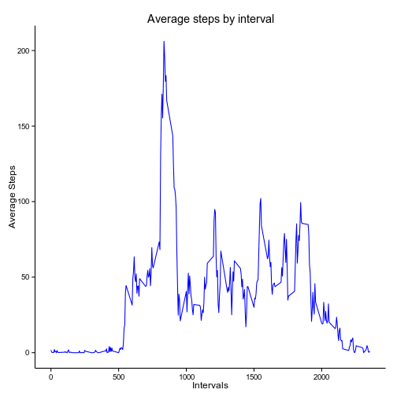

This assignment will work with data from a personal activity monitoring
device. The data contains 17568 observations and 3 variables that include:  

- the number of steps a person takes every 5 minutes (**steps**) 
- the date in which the data was collected (**date**)
- the interval identifier (**interval**)  

Each of the following sections will contain information of how the data is
processed and it also contains the R code to reproduce the results.

## Loading and preprocessing the data
The first step in processing the data is to load it and transform any variables
to an appropriate format. First, the *dplyr* package is loaded for convenience.

```r
library(dplyr)
```

Since the data is in a *.zip* format, the easiest way to load it is to unzip it
and then read the csv file. Also, it is important to transform the date variable
to an appropriate format. Finally, the data is converted to a more efficient format.


```r
unzip("activity.zip")
data <- read.csv("activity.csv", header = TRUE, stringsAsFactors = FALSE)
# Modifying the date format
data$date <- as.Date(data$date)
# Changing dataframe to tbl_df format
data <- tbl_df(data)
str(data)
```

```
## Classes 'tbl_df', 'tbl' and 'data.frame':	17568 obs. of  3 variables:
##  $ steps   : int  NA NA NA NA NA NA NA NA NA NA ...
##  $ date    : Date, format: "2012-10-01" "2012-10-01" ...
##  $ interval: int  0 5 10 15 20 25 30 35 40 45 ...
```

The results above, show the structure of the loaded data set.

## What is mean total number of steps taken per day?

In this section, the following steps will be performed:  
1. Calculate the total number of steps per day  
2. Display the total numbers of steps per day in a histogram  
3. Report the mean and median of the number of steps per day  

To calculate the total number of steps per day, the *dplyr* package is very handy.
In addition, the **NA** values will be omitted for this part.


```r
steps.daily <-  data  %>% 
                na.omit(data) %>% 
                group_by(date) %>% 
                summarise(dailyStep = sum(steps, na.rm=TRUE))
# Checking the results
steps.daily
```

```
## Source: local data frame [53 x 2]
## 
##          date dailyStep
## 1  2012-10-02       126
## 2  2012-10-03     11352
## 3  2012-10-04     12116
## 4  2012-10-05     13294
## 5  2012-10-06     15420
## 6  2012-10-07     11015
## 7  2012-10-09     12811
## 8  2012-10-10      9900
## 9  2012-10-11     10304
## 10 2012-10-12     17382
## ..        ...       ...
```

To carry out step 2, the *ggplot2* package will be of use.


```r
library(ggplot2)
```

The histogram is generated as follows:


```r
ggplot(data = steps.daily, aes(dailyStep)) + 
    geom_histogram(breaks = seq(0, 21200, by=1000), color = "black", fill="blue",alpha = .75) +
    labs(title = "Histogram of daily steps") +
    labs(x = "Number of daily steps", y= "Frequency") +
    theme_classic(base_family = "Arial")
```

 

Note that the above histogram is set up with bin sizes of 1000 and
using a classic theme. Generating the mean and median of the data is simple
given that the *steps.daily* already contains the required data.


```r
mean(steps.daily$dailyStep)
```

```
## [1] 10766.19
```

```r
median(steps.daily$dailyStep)
```

```
## [1] 10765
```

## What is the average daily activity pattern?

To understand this question, a time series plot of the average daily activity
is required. Based on the plot, it will be possible to determine which interval
value corresponds to the highest patter.  

Prior to plotting the data, it is necessary to obtain the average number of steps
given each of the intervals. This is done in the following code:


```r
avg.daily <- data  %>%
    # Clearing all NAs
    na.omit(data) %>% 
    # Grouping data based on the interval column
    group_by(interval) %>% 
    # Averaging all steps based on the given interval group
    mutate(meanSteps = mean(steps, na.rm = TRUE))
```

Now, using the *ggplot2* library, the time series can be obtained as follows:


```r
ggplot(data = avg.daily, aes(interval, meanSteps)) + 
    # Blue lines, why not!
    geom_line(color = "blue") +
    labs(title = "Average steps by interval") +
    labs(x = "Intervals", y = "Average Steps") +
    theme_classic(base_family = "Arial")
```

 

The above plot shows that the maximum average happens anywhere between the 700
and 900 interval. To obtain the exact interval:


```r
avg.daily[which.max(avg.daily$meanSteps),"interval"]
```

```
## Source: local data frame [1 x 1]
## Groups: interval
## 
##   interval
## 1      835
```

## Imputing missing values

In this section, all missing values will be replaced with some quantity to check
how the data changes accordingly. The first step is to count the total number
of **NA** values in the data set.


```r
with(data, sum(is.na(steps) | is.na(date) | is.na(interval)))
```

```
## [1] 2304
```

Note that the count is done by accounting for missing values in each of the
columns. An exploration of the data revealed that only the "steps" variable
contains NAs.  

The missing values will be changed using the values obtained in the previous
section, that is, using the average values per interval. To do so, a data frame
containing all the averages per interval can be obtained and matched to any
missing value, as long as the interval number matches.


```r
# A new data frame that contains interval and average steps only
replace.na <- unique(avg.daily[,3:4])
# Generating a new dataframe
clean.data <- data
clean.data$steps <- ifelse(is.na(clean.data$steps), 
                    replace.na$meanSteps[match(clean.data$interval,replace.na$interval)],
                    clean.data$steps)
# Checking new data
str(clean.data)
```

```
## Classes 'tbl_df', 'tbl' and 'data.frame':	17568 obs. of  3 variables:
##  $ steps   : num  1.717 0.3396 0.1321 0.1509 0.0755 ...
##  $ date    : Date, format: "2012-10-01" "2012-10-01" ...
##  $ interval: int  0 5 10 15 20 25 30 35 40 45 ...
```

It is possible to generate a similar histogram as in the first section. This will
provide an idea on how the results changed by replacing missing values.


```r
steps.daily.clean <-  clean.data  %>% 
                group_by(date) %>% 
                summarise(dailyStep = sum(steps, na.rm=TRUE))

ggplot(data = steps.daily.clean, aes(dailyStep)) + 
    geom_histogram(breaks = seq(0, 21200, by=1000), color = "black", fill="blue",alpha = .75) +
    labs(title = "Histogram of daily steps - No missing data") +
    labs(x = "Number of daily steps", y= "Frequency") +
    theme_classic(base_family = "Arial")
```

 

It can be noted that the histogram shape does not change very much, in fact the
only difference in this case is an increase in the frequency of the more popular
number of daily steps. This is expected due to more data points in the set.  

Similar to the first part, the mean and the median can be easily calculated as 
follows:


```r
mean(steps.daily.clean$dailyStep)
```

```
## [1] 10766.19
```

```r
median(steps.daily.clean$dailyStep)
```

```
## [1] 10766.19
```

The value of the average did not change as we are adding more average values. The 
median on the other hand, changed slightly due to the increase of values in the 
data.

## Are there differences in activity patterns between weekdays and weekends?

The purpose of this section is to check the difference in activity during the 
weekday and the weekend. To do so, the data must be divided into the appropriate 
type. This can be accomplished as follows:


```r
# Modifying the clean.data table to include two factors.
clean.data <- clean.data %>% mutate(weekType = as.factor(ifelse(weekdays(date) %in% 
                                    c("Saturday","Sunday"), "Weekend", "Weekday")))
```

The code above, generates a new column that with values *Weekend* or *Weekday* 
depending on the date variable. With that in mind, it is possible to generate 
a time series data.


```r
avg.daily.clean <- clean.data  %>% 
    # Grouping by interval and weektype
    group_by(interval, weekType) %>% 
    mutate(meanSteps = mean(steps, na.rm = TRUE)) 

# Checking the data
avg.daily.clean
```

```
## Source: local data frame [17,568 x 5]
## Groups: interval, weekType
## 
##        steps       date interval weekType  meanSteps
## 1  1.7169811 2012-10-01        0  Weekday 2.25115304
## 2  0.3396226 2012-10-01        5  Weekday 0.44528302
## 3  0.1320755 2012-10-01       10  Weekday 0.17316562
## 4  0.1509434 2012-10-01       15  Weekday 0.19790356
## 5  0.0754717 2012-10-01       20  Weekday 0.09895178
## 6  2.0943396 2012-10-01       25  Weekday 1.59035639
## 7  0.5283019 2012-10-01       30  Weekday 0.69266247
## 8  0.8679245 2012-10-01       35  Weekday 1.13794549
## 9  0.0000000 2012-10-01       40  Weekday 0.00000000
## 10 1.4716981 2012-10-01       45  Weekday 1.79622642
## ..       ...        ...      ...      ...        ...
```

With the new data, it is possible to generate the time series plot. This time, 
the plot will be separated into panels. One panel will be for the weekdays and 
the second panel will be for the weekends. This will help identify the major 
differences between the two.


```r
ggplot(data = avg.daily.clean, aes(interval, meanSteps)) + 
    geom_line(color = "blue") +
    # Adding the panels
    facet_grid(weekType ~ .) +
    labs(title = "Average steps by interval") +
    labs(x = "Intervals", y = "Average Steps") +
    # Applying a gray theme for best contrast
    theme_gray(base_family = "Arial")
```

 

As a general observation it can be noted that during the weekends, there are 
more peaks with higher averages. This implies that this person is more active 
during the weekends than during the weekdays.
